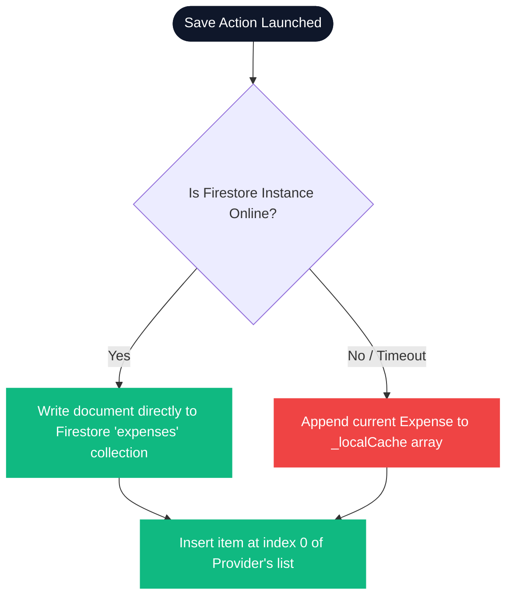

# 🧾 ScanSpend — Master Interview & Technical Guide

This guide is dedicated exclusively to **ScanSpend** (Flutter-based AI Expense Tracker). It details the system architecture, dual-path parsing logic, data schema, and core CS fundamentals (OOP, DSA, SQL, error handling) using **custom-styled, colorful diagrams** to make your interview preparation visually engaging.

---

## 1. Project Profile

* **Platform:** Android & iOS (Flutter / Dart)
* **Your Role:** Flutter Mobile Developer
* **Objective:** Build an AI-powered expense tracking application that scans receipts, recognizes text locally via OCR, structures it via Generative AI, and saves it to a cloud database.
* **Core Outcomes:**
  * **Zero-Server Costs:** The system orchestrates OCR on-device and leverages direct Generative AI APIs, eliminating backend server maintenance fees.
  * **Dual-Path Parsing Pipeline:** Direct image bytes parse with a fallback to OCR text parsing, ensuring a high extraction success rate.
  * **High Performance:** On-device OCR processes in **under 2 seconds**; structured JSON extraction completes in **under 5 seconds**.
  * **Offline Stability:** Integrated client-side caching ensures the application is offline-first and doesn't crash during network failures.

---

## 2. System Architecture

ScanSpend is built on a **Layered and Modular Architecture** to separate UI components, business logic, hardware controllers, and databases.


* **UI Layer:** Found in [lib/screens](file:///c:/Users/izhaa/AndroidStudioProjects/ScanSpend/lib/screens). The central controllers are [ScanScreen](file:///c:/Users/izhaa/AndroidStudioProjects/ScanSpend/lib/screens/scan_screen.dart) (handles camera preview, custom shutter animations, flash toggle) and [ReviewScreen](file:///c:/Users/izhaa/AndroidStudioProjects/ScanSpend/lib/screens/review_screen.dart) (houses item list inputs and total overrides).
* **State Management (Provider):** Implemented in [lib/providers/expense_provider.dart](file:///c:/Users/izhaa/AndroidStudioProjects/ScanSpend/lib/providers/expense_provider.dart). This layer keeps track of loading states, the active expense being edited, and syncs history.
* **Services Layer:** Extracted into [lib/services](file:///c:/Users/izhaa/AndroidStudioProjects/ScanSpend/lib/services). It separates networking and device integrations from UI states.

---

## 3. Receipt Processing Workflow (OCR + AI Pipeline)

The workflow handles direct image analysis and implements an automatic fallback mechanism to handle poor connection issues or parsing failures.


### Flow Breakdown
1. **Direct Path (Multimodal Vision):** [ScanScreen](file:///c:/Users/izhaa/AndroidStudioProjects/ScanSpend/lib/screens/scan_screen.dart) sends image bytes to [AIService.parseReceiptImage](file:///c:/Users/izhaa/AndroidStudioProjects/ScanSpend/lib/services/ai_service.dart#L59) using a structured instruction to output formatted JSON.
2. **Fallback Path (Local OCR + Text Parse):** If the vision API returns `_fallback_needed` (no merchant recognized or bad image contrast), it invokes [OCRService](file:///c:/Users/izhaa/AndroidStudioProjects/ScanSpend/lib/services/ocr_service.dart). ML Kit parses the text locally on the device, and the raw text block is sent to [AIService.parseReceiptText](file:///c:/Users/izhaa/AndroidStudioProjects/ScanSpend/lib/services/ai_service.dart#L86) to extract JSON fields.

---

## 4. NoSQL Data Schema & Caching Layout

### Firebase Firestore Layout
```
expenses/ (Root Collection)
 └── {expenseId}/ (Document ID: Client-side milliseconds timestamp)
      ├── merchantName: String       (e.g., "MegaMart")
      ├── date: String               (ISO 8601 string)
      ├── total: Double              (Sum of items, editable)
      ├── category: String           ("Groceries", "Utilities", "Food & Dining", etc.)
      ├── items: Array [Map]
      │    └── {index}/
      │         ├── name: String
      │         └── price: Double
      ├── memo: String               (Optional notes)
      ├── status: String             ("completed", "pending")
      └── timestamp: FieldValue.serverTimestamp()
```

### Client-Side Caching Logic
To guarantee an offline-first experience, [FirestoreService](file:///c:/Users/izhaa/AndroidStudioProjects/ScanSpend/lib/services/firestore_service.dart) holds a local array cache:



---

## 5. CS Fundamentals & Coding Principles

### A. Object-Oriented Programming (OOP) in ScanSpend
* **Abstraction:** The UI interacts with [OCRService](file:///c:/Users/izhaa/AndroidStudioProjects/ScanSpend/lib/services/ocr_service.dart) via a single method `extractTextFromImage(path)`. The underlying C++ image processing, line grouping, and bounding box calculations are hidden from the visual screens.
* **Encapsulation:** The [ExpenseProvider](file:///c:/Users/izhaa/AndroidStudioProjects/ScanSpend/lib/providers/expense_provider.dart) encapsulates the local cache `_expenses` using a private list. The UI accesses it using a read-only getter (`List<Expense> get expenses => _expenses;`) and updates the state via formal setter methods (`updateItemAt()`, `updateTotal()`).
* **Inheritance:** `ExpenseProvider` extends `ChangeNotifier` to inherit state-binding properties, notifying Flutter widgets to rebuild whenever `notifyListeners()` is called.
* **Polymorphism:** You can declare a base class `ImageSourceAdapter` and implement subclasses `CameraAdapter` and `GalleryAdapter` to decouple picture acquisition.

---

### B. Data Structures & Algorithms (DSA)
* **Lists / Arrays:** Used in [history_screen.dart](file:///c:/Users/izhaa/AndroidStudioProjects/ScanSpend/lib/screens/history_screen.dart) to present sorted lists of expenses. Adding a new scan inserts it at index `0` in $O(1)$ time complexity.
* **Maps / Key-Value Pairs:** The `Item` and `Expense` classes serialize and deserialize data via `Map<String, dynamic>` maps to interact with Firestore and the Gemini JSON output.
* **Stack (LIFO):** The routing system in Flutter manages page navigation via a LIFO (Last In, First Out) stack. The navigator pushes `ScanScreen` onto the stack, replacement-routes it with `ReviewScreen`, and pops it to return to `DashboardScreen` when saved.
* **Regular Expressions (Regex) & Parsing:** Used in string cleaning algorithms to strip formatting blocks (like Markdown formatting backticks) and locate the opening `{` and closing `}` index bounds of JSON data within raw AI returns.

---

### C. SQL & Querying Analogy
Although ScanSpend stores data in NoSQL Firestore, interviews often test relational SQL querying equivalents. If ScanSpend were mapped to an SQL database, here is how you would query it:

```sql
-- 1. Get total spending grouped by category for user 'u_77'
SELECT 
    category,
    SUM(total_amount) AS category_total
FROM expenses
WHERE user_id = 'u_77'
GROUP BY category
ORDER BY category_total DESC;

-- 2. Find all receipt items costing more than $50.00 using an INNER JOIN
SELECT 
    e.merchant_name,
    i.name AS item_name,
    i.price AS item_price
FROM expenses e
INNER JOIN expense_items i ON e.id = i.expense_id
WHERE i.price > 50.00;
```

---

## 6. Technical Communication & Presentation Tips

To successfully present ScanSpend during a technical interview, use the **STAR-C Framework**:

* **S - Situation:** Detail the business or technical problem.
  * *ScanSpend Example:* Manual expense tracking is slow and error-prone. Our goal was to create an automated, zero-infrastructure cost mobile MVP that handles scanning and item parsing in under 5 seconds.
* **T - Task:** Your specific role and objective.
  * *ScanSpend Example:* "My responsibility was to implement the Flutter UI, build the OCR/AI processing pipelines, and configure Firestore backend synchronization."
* **A - Action:** How you solved it (architecture, libraries, optimizations).
  * *ScanSpend Example:* Explain the dual-path parse flow: running a direct Vision parse first, and falling back to local ML Kit OCR + text prompting if the vision parser is blocked or fails.
* **R - Result:** Measurable metrics.
  * *ScanSpend Example:* "We achieved a local OCR extraction time of under 2 seconds, with full AI structural parsing completing in 4.2 seconds."
* **C - Challenge & Trade-offs:** What went wrong and how you solved it.
  * *ScanSpend Example:* Discuss the Gemini API key exposure security trade-off and how we design for production by moving keys behind Firebase Cloud Functions.

---

## 7. Expected Interview Questions & Model Answers

### Q1: Why did you use Provider for state management? Why not Bloc or Redux?
> **Model Answer:** Provider is the standard, lightweight solution recommended by the Flutter team. It uses Flutter's native `InheritedWidget` to propagate updates down the widget tree. Since ScanSpend is a 1-week MVP focusing on a linear user flow (Scan $\rightarrow$ Extract $\rightarrow$ Review $\rightarrow$ Save), Provider provides clean state separation without the boilerplate code of Bloc or the complexity of Redux. It makes state mutations like editing individual item details clean and maintainable.

### Q2: What is the benefit of the JSON Output Mode in Gemini Pro, and how did you handle invalid JSON formatting?
> **Model Answer:** The Gemini API offers `responseMimeType: 'application/json'` under its `GenerationConfig` settings. This forces the model to respond strictly with valid JSON conforming to our schema. However, to handle edge cases, our [AIService](file:///c:/Users/izhaa/AndroidStudioProjects/ScanSpend/lib/services/ai_service.dart) implements a cleaning regex: it extracts data between the first `{` and the last `}` character, stripping away code fences like ````json` if generated. If JSON parsing still fails, our app catches the error and falls back to OCR text extraction, ensuring the app remains stable.

### Q3: How did you implement real-time calculation of the total amount on the Review Screen?
> **Model Answer:** On the [ReviewScreen](file:///c:/Users/izhaa/AndroidStudioProjects/ScanSpend/lib/screens/review_screen.dart), all line items are editable text fields. When a user changes a price, the input triggers `provider.updateItemAt(index, price: newPrice)`. The [ExpenseProvider](file:///c:/Users/izhaa/AndroidStudioProjects/ScanSpend/lib/providers/expense_provider.dart) copies the `Expense` model with the updated items, recalculates the sum of all item prices, updates the total, and calls `notifyListeners()`. The UI, listening via a `Consumer`, automatically updates the bottom Total Card, reflecting changes in real-time.
